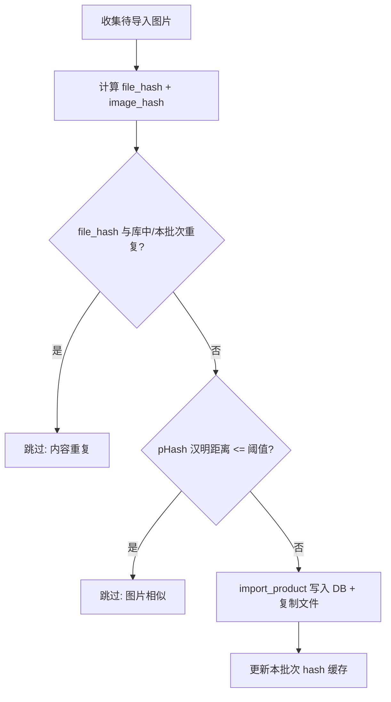

# 导入图片去重（内容 + 视觉相似）

## 现状

[`db/models.py`](db/models.py) 的 `batch_import` → `import_product` 对每张图片直接 `INSERT` + `shutil.copy2`，无任何与已有产品的对比逻辑。同一张图多次导入会产生多条产品记录。

```176:185:d:\code\alexcard_inventory\db\models.py
def batch_import(paths: list[Path]) -> tuple[list[Product], list[str]]:
    """Import multiple images. Returns (successful products, error messages)."""
    products: list[Product] = []
    errors: list[str] = []
    for path in collect_image_paths(paths):
        try:
            products.append(import_product(path))
        except Exception as exc:
            errors.append(f"{path.name}: {exc}")
    return products, errors
```

## 目标行为



- **内容重复**：SHA-256 完全一致（不同文件名/路径也算重复）
- **视觉相似**：pHash 汉明距离 ≤ 5（同一张卡牌不同分辨率/裁剪/压缩）
- **跳过策略**：静默跳过，导入结束后汇总「成功 X / 跳过 Y / 失败 Z」，跳过的文件列出文件名与原因（最多展示 10 条）

## 1. 依赖

在 [`requirements.txt`](requirements.txt) 增加：

```
imagehash>=4.3
```

（底层仍用已有 `Pillow`；`opencv-python-headless` 本功能不需要。）

## 2. 数据库：新增 hash 列 + 迁移

在 [`db/database.py`](db/database.py) 的 `init_db()` 中增加轻量迁移（`PRAGMA table_info` 检测列是否存在）：

```sql
ALTER TABLE products ADD COLUMN file_hash TEXT;
ALTER TABLE products ADD COLUMN image_hash TEXT;
CREATE INDEX IF NOT EXISTS idx_products_file_hash ON products(file_hash);
```

- `file_hash`：SHA-256 十六进制字符串，用于 O(1) SQL 查重
- `image_hash`：pHash 十六进制字符串，用于汉明距离比对（无法靠 B-tree 索引，导入时一次性加载到内存）

**存量数据回填**：迁移后对 `file_hash IS NULL` 的行，读取 `data/{image_path}` 计算两列 hash 并 `UPDATE`（文件缺失则跳过，不影响启动）。

## 3. 数据层：hash 计算与查重

在 [`db/models.py`](db/models.py) 新增：

| 函数 | 职责 |
|------|------|
| `compute_file_hash(path) -> str` | `hashlib.sha256` 分块读文件 |
| `compute_image_hash(path) -> str` | `imagehash.phash(PIL.Image.open(...))` → `str(hash)` |
| `is_visually_similar(h1, h2, threshold=5) -> bool` | 汉明距离比较 |
| `load_product_hashes() -> tuple[set[str], list[tuple[str, Product]]]` | 启动导入前加载全部 `file_hash` 集合 + `(image_hash, Product)` 列表 |
| `find_duplicate(source_path, known_file_hashes, known_image_hashes) -> tuple[Product\|None, str\|None]` | 返回 `(已有产品, 原因)` 或 `(None, None)` |

**查重顺序**（每张待导入图）：

1. 计算 `file_hash`、`image_hash`（失败则记入 errors）
2. 若 `file_hash` 已在 DB 或**本批次已导入缓存**中 → 跳过，原因「内容重复」
3. 否则遍历 `known_image_hashes`，汉明距离 ≤ 5 → 跳过，原因「图片相似（与「{existing.name}」）」
4. 通过则调用改造后的 `import_product`，写入两列 hash，并更新本批次缓存

### 改造 `import_product`

- 签名改为 `import_product(source_path, file_hash: str, image_hash: str) -> Product`（hash 由调用方预先算好，避免重复 IO）
- `INSERT` 时直接写入 `file_hash`、`image_hash`

### 改造 `batch_import`

- 返回类型扩展为三元组：

```python
tuple[list[Product], list[str], list[str]]  # (成功, 错误, 跳过说明)
```

- 导入开始前调用 `load_product_hashes()` 一次
- 维护 `batch_file_hashes: set[str]` 与 `batch_image_hashes: list[tuple[str, Product]]` 追踪同批次内重复

## 4. UI 反馈

修改 [`ui/product_tab.py`](ui/product_tab.py) 的 `import_images_dialog`：

```python
products, errors, skipped = models.batch_import(paths)
message = f"成功导入 {len(products)} 张图片。"
if skipped:
    message += f"\n跳过 {len(skipped)} 张重复图片。"
    message += "\n" + "\n".join(skipped[:10])
    ...
if errors:
    ...
```

## 5. 关键常量

在 `models.py` 顶部定义：

```python
PHASH_SIMILARITY_THRESHOLD = 5
```

卡牌缩略图场景下 5 是常用默认值；若后续误杀/漏杀可再调。

## 6. 边界情况

| 场景 | 行为 |
|------|------|
| 同批次选了两份相同文件 | 第一份导入，第二份「内容重复」跳过 |
| 同批次两张视觉相同但字节不同 | 第一份导入，第二份「图片相似」跳过 |
| 再次导入历史上已入库的图 | DB hash 命中，跳过 |
| 损坏/无法解码的图片 | 记入 errors，不插入 DB |
| 旧产品图片文件被手动删除 | 回填时跳过；不影响新导入 |

## 涉及文件

- [`requirements.txt`](requirements.txt) — 添加 `imagehash`
- [`db/database.py`](db/database.py) — 列迁移 + 索引
- [`db/models.py`](db/models.py) — hash 工具、查重、`import_product` / `batch_import` 改造
- [`ui/product_tab.py`](ui/product_tab.py) — 导入结果消息展示

## 验证步骤

1. `pip install -r requirements.txt`
2. 导入一张新图 → 成功，网格 +1
3. 再次导入同一张图 → 提示跳过 1 张「内容重复」，数量不变
4. 导入同图另存为（不同文件名/轻微压缩）→ 提示「图片相似」跳过
5. 重启应用后重复步骤 3 → 仍正确跳过（hash 持久化）
6. 批量导入含重复文件的文件夹 → 汇总数字正确
