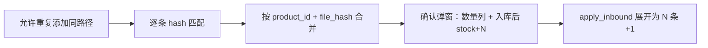

# 入库重复图片按次数累加入库

## 现状问题

两处逻辑阻止了「同图重复多次 → 库存加多次」：

1. [`ui/inbound_tab.py`](ui/inbound_tab.py) `_add_paths()` 用 `resolved in {...}` **去重**，同一路径只能进列表一次
2. [`db/models.py`](db/models.py) `collect_image_paths()` 用 `seen` 集合 **去重**，`match_inbound_images()` 调用它后重复路径只处理一次

写库层 [`apply_inbound_batch()`](db/models.py) 已是「每条记录 +1」，无需改动核心事务逻辑。

---

## 目标行为



示例：同一张 `pic.jpg` 添加 3 次 → 确认弹窗 1 行「数量 3，入库后 stock+3」→ 确定后该产品库存 +3。

---

## 1. 允许重复添加 — [`ui/inbound_tab.py`](ui/inbound_tab.py)

**`_add_paths()`**：删除 `resolved in {...}` 去重判断，每次选择/拖入都追加到 `_paths` 和列表。

列表项显示建议：`pic.jpg` 或 `pic.jpg (第2次)` 仅在连续重复时可选；最简方案保持文件名，重复时会出现多行同名项。

---

## 2. 保留重复路径的展开 — [`db/models.py`](db/models.py)

新增专用函数（**不修改** `collect_image_paths`，避免影响 `batch_import` 去重）：

```python
def expand_inbound_paths(paths: list[Path]) -> list[Path]:
    """展开文件夹为图片列表，但保留用户重复添加的同一路径。"""
```

- 文件：每次出现都 append（不做 `seen` 去重）
- 文件夹：仍展开内部图片；文件夹本身重复添加则内部文件也重复计入

`match_inbound_images()` 改为调用 `expand_inbound_paths` 替代 `collect_image_paths`。

---

## 3. 合并匹配结果 — [`db/models.py`](db/models.py)

新增聚合 dataclass：

```python
@dataclass
class InboundMatchGroup:
    source_path: Path          # 代表缩略图（组内第一张）
    source_name: str
    existing_product: Product
    reason: str
    quantity: int
    source_paths: list[Path]   # 组内全部路径，供 inventory_logs 记录
```

新增 `aggregate_inbound_matches(matches: list[InboundMatch]) -> list[InboundMatchGroup]`：

- 聚合键：`(product_id, file_hash)`（`file_hash` 在匹配时已有，可写入 `InboundMatch` 或聚合时再算）
- 同产品、同内容的多条 `InboundMatch` 合并为 1 组，`quantity` 累加

为减少重复 IO，在 `InboundMatch` 中增加 `file_hash: str` 字段（匹配时已计算）。

---

## 4. 确认弹窗合并展示 — [`ui/inbound_confirm_dialog.py`](ui/inbound_confirm_dialog.py)

- 输入改为 `list[InboundMatchGroup]`
- 表头增加 **「数量」** 列；**「入库后」** 改为 `stock + quantity`（按组内数量累加）
- `selected_items()`：对每个勾选组，按 `source_paths` 展开为多个 `InboundItem` 传给现有 `apply_inbound()`（写库逻辑不变，仍是一条 log 对应一次 +1）

列顺序建议：`勾选 | 入库图 | 已有产品 | 名称 | 匹配原因 | 数量 | 当前库存 | 入库后`

---

## 5. 串联改动 — [`ui/inbound_tab.py`](ui/inbound_tab.py)

`_on_finished()` 流程：

```python
matches, unmatched = models.match_inbound_images(paths)
groups = models.aggregate_inbound_matches(matches)
dialog = InboundConfirmDialog(groups, self)
```

状态栏文案改为：`匹配 N 组（共 M 张）`（M = sum of quantities）。

---

## 验证清单

1. 同一路径图片添加 3 次 → 列表 3 项 → 识别后确认弹窗 1 行数量 3 → 确定后 stock +3
2. 两个不同路径但内容相同（同 SHA）→ 合并为 1 行数量 2
3. 不同产品各 1 张 → 仍为多行，各 +1
4. 取消勾选某组 → 该组数量不计入入库
5. `inventory_logs` 写入条数 = 实际入库次数（如数量 3 则 3 条 log）

---

## 不涉及

- `batch_import` / 新增产品去重逻辑不变
- `apply_inbound_batch` 接口不变（仍接收 `(product_id, image_path)` 列表，由 UI 层按 quantity 展开）
