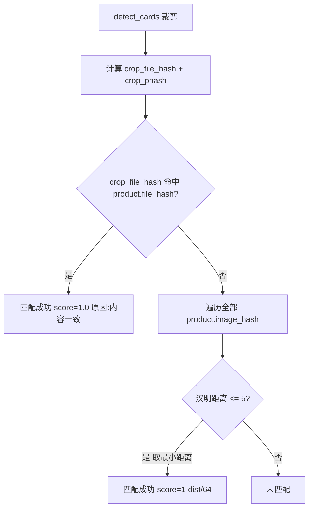

# 入库模块：SHA-256 + pHash 匹配改造

## 背景

| 模块 | 当前判定方式 | 目标 |
|------|-------------|------|
| 产品导入 ([`db/models.py`](db/models.py) `batch_import`) | SHA-256 + pHash ≤ 5 | 不变 |
| 入库识别 ([`core/matcher.py`](core/matcher.py)) | pHash Top-K 预筛 + CLIP 余弦 ≥ 0.90 | **改为 SHA-256 + pHash ≤ 5** |

入库与导入将共用同一套 hash 基础设施（`file_hash` / `image_hash` 列、`PHASH_SIMILARITY_THRESHOLD = 5`），判定逻辑对齐。

## 新匹配流程



**与导入查重的差异**：导入遇到第一个 pHash 命中即跳过；入库匹配应在所有 ≤ 5 的候选中取**汉明距离最小**的产品，避免误配。

**SHA-256 说明**：crop 以 PNG 编码后算 hash，与产品库中原始导入文件（jpg/png 等）的 `file_hash` 比对。仅当用户上传与参考图**字节完全一致**的文件时命中；日常拍照裁剪主要依赖 pHash。

## 1. 抽取共享匹配函数 — [`db/models.py`](db/models.py)

新增 `find_product_by_hashes()`，供入库 matcher 调用；重构现有 `_find_duplicate_by_hashes()` 复用同一核心逻辑：

```python
def find_product_by_hashes(
    file_hash: str,
    image_hash: str,
    known_file_hashes: dict[str, Product],      # file_hash -> product
    known_image_hashes: list[tuple[str, Product]],
) -> tuple[Product | None, str | None, float | None]:
    """返回 (product, reason, score)。score: SHA=1.0, pHash=1-dist/64。"""
```

- SHA-256 命中 → `(product, "内容一致", 1.0)`
- pHash 命中（取最小距离）→ `(product, "视觉相似", 1.0 - dist/64)`
- 无命中 → `(None, None, None)`

同步调整 `load_product_hashes()` 返回 `dict[str, Product]`（file_hash 映射），便于 O(1) 查找。

扩展 `ProductMatchRow`，增加 `file_hash: str | None`，移除 `embedding` 字段。

改造 `load_products_for_matching()`：

```sql
SELECT id, name, image_path, stock, file_hash, image_hash
FROM products
WHERE image_path != ''
  AND (file_hash IS NOT NULL OR image_hash IS NOT NULL)
```

## 2. 重写 matcher — [`core/matcher.py`](core/matcher.py)

删除全部 CLIP 相关代码（`ClipEmbedder`、`_embeddings`、`_select_candidates` Top-K 预筛、`clip_threshold`）。

新 `ProductMatcher` 接口：

```python
class ProductMatcher:
    def __init__(self) -> None: ...

    def build_index(self) -> None:
        # 从 load_products_for_matching() 构建 file_hash 映射 + image_hash 列表

    def match_crop(self, crop_file_hash: str, crop_phash: str) -> MatchCandidate:
        # 调用 find_product_by_hashes()
```

`MatchCandidate.score` 沿用现有字段，UI「相似度」列无需改动。

## 3. 简化入库 Worker — [`ui/inbound_tab.py`](ui/inbound_tab.py)

`RecognitionWorker.run()` 改动：

- **删除**：`ClipEmbedder` 初始化、CLIP 模型路径检查、`embedding` 前置条件
- **新增**：对每个 crop 在保存前用 `cv2.imencode(".png", crop.image)` 得到字节，调用 `compute_bytes_hash()`（在 models.py 新增，与 `compute_file_hash` 共用 `hashlib.sha256` 逻辑）
- 调用 `matcher.match_crop(crop_file_hash, crop_phash)`
- 空库错误改为：「产品库为空或尚无 hash，请先导入产品。」

## 4. 移除 CLIP/embedding 基础设施

| 文件 | 操作 |
|------|------|
| [`core/embedder.py`](core/embedder.py) | 删除 |
| [`scripts/backfill_embeddings.py`](scripts/backfill_embeddings.py) | 删除 |
| [`db/models.py`](db/models.py) | 删除 `_compute_and_save_embedding`、`save_product_embedding`、`backfill_product_embeddings`；`import_product` 末尾不再调用 embedding 计算 |
| [`db/database.py`](db/database.py) | `init_db()` 移除 `backfill_product_embeddings()` 调用；**保留** `embedding` 列迁移（已有数据库不破坏，列闲置） |
| [`settings/config.py`](settings/config.py) + [`settings/config.json`](settings/config.json) | 移除 `clip_threshold`、`phash_top_k`、`clip_model_path` |
| [`requirements.txt`](requirements.txt) | 移除 `onnxruntime>=1.16` |
| [`README.md`](README.md) | 删除 CLIP 模型下载、embedding 补算、相关配置项说明；补充入库匹配规则说明 |

## 5. UI 与类型（最小改动）

- [`core/types.py`](core/types.py) `RecognitionResult` — 不变
- [`ui/match_dialog.py`](ui/match_dialog.py) — 不变（`score` 字段继续展示）
- 可选：未匹配行 score 显示 `—`（现有逻辑已支持）

## 关键常量

继续使用 [`db/models.py`](db/models.py) 第 17 行：

```python
PHASH_SIMILARITY_THRESHOLD = 5
```

入库与导入共用，无需新增配置项。

## 验证步骤

1. `pip install -r requirements.txt`（确认 onnxruntime 已移除后环境正常）
2. 导入一张产品参考图 → 确认 `file_hash` / `image_hash` 写入 DB，**不再**生成 embedding
3. 入库 Tab 上传**同一张参考图**（整图或裁剪后）→ 应匹配成功，相似度 1.00（SHA 命中）
4. 上传同卡牌不同分辨率/压缩版本 → pHash 命中，相似度 < 1.00
5. 上传无关图片 → 「未匹配」，确认弹窗中不可勾选
6. 重启应用后重复步骤 3–5 → hash 持久化，无需 CLIP 模型
7. 多卡合照 → 各 crop 独立匹配，结果正确

## 涉及文件汇总

- 核心改动：[`core/matcher.py`](core/matcher.py)、[`db/models.py`](db/models.py)、[`ui/inbound_tab.py`](ui/inbound_tab.py)
- 清理：[`core/embedder.py`](core/embedder.py)、[`scripts/backfill_embeddings.py`](scripts/backfill_embeddings.py)、[`db/database.py`](db/database.py)、[`settings/config.py`](settings/config.py)、[`settings/config.json`](settings/config.json)、[`requirements.txt`](requirements.txt)、[`README.md`](README.md)
