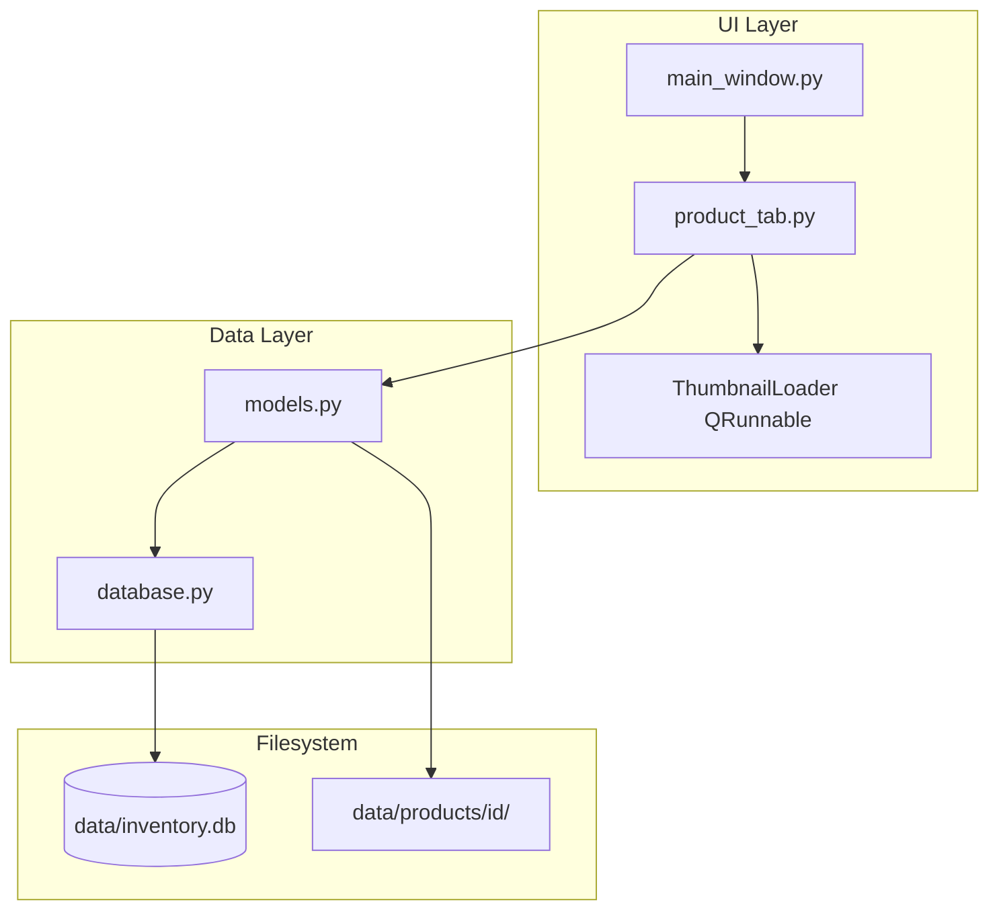
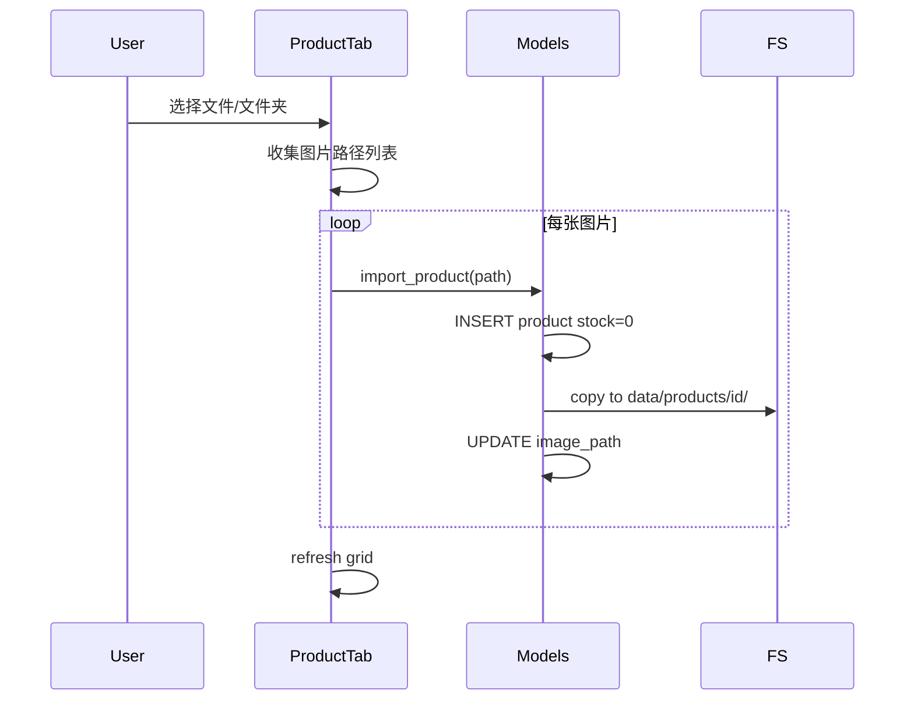

# 阶段一：产品库管理实现计划

## 现状

项目为 **greenfield**（仅 `.git/` 存在，无应用代码）。将按需求从零创建完整目录与模块。

## 目标架构



## 目录与文件清单

| 文件 | 职责 |
|------|------|
| [`main.py`](main.py) | 入口：创建 `QApplication`，初始化 DB，启动主窗口 |
| [`requirements.txt`](requirements.txt) | `PySide6`, `Pillow`, `opencv-python-headless`（本阶段主要用 Pillow 缩略图） |
| [`README.md`](README.md) | 安装依赖、`python main.py` 运行说明 |
| [`.gitignore`](.gitignore) | 忽略 `data/`、`__pycache__/`、`.venv/` |
| [`db/database.py`](db/database.py) | SQLite 连接、建表、`get_db()` 单例 |
| [`db/models.py`](db/models.py) | dataclass + CRUD 函数 |
| [`ui/main_window.py`](ui/main_window.py) | `QMainWindow` + `QTabWidget` |
| [`ui/product_tab.py`](ui/product_tab.py) | 产品管理全部 UI 逻辑 |

运行时自动创建：`data/inventory.db`、`data/products/{id}/`。

---

## 1. 数据层

### 1.1 表结构（[`db/database.py`](db/database.py)）

```sql
CREATE TABLE IF NOT EXISTS categories (
    id INTEGER PRIMARY KEY AUTOINCREMENT,
    name TEXT NOT NULL UNIQUE,
    sort_order INTEGER NOT NULL DEFAULT 0,
    created_at TEXT NOT NULL DEFAULT (datetime('now','localtime'))
);

CREATE TABLE IF NOT EXISTS products (
    id INTEGER PRIMARY KEY AUTOINCREMENT,
    category_id INTEGER NULL REFERENCES categories(id) ON DELETE SET NULL,
    name TEXT NOT NULL,
    image_path TEXT NOT NULL,
    stock INTEGER NOT NULL DEFAULT 0,
    created_at TEXT NOT NULL DEFAULT (datetime('now','localtime'))
);
```

- 使用 `pathlib.Path` 处理 Windows 路径，DB 中存相对路径（如 `products/3/image.jpg`），便于迁移。
- `init_db()` 在 [`main.py`](main.py) 启动时调用，确保 `data/` 目录存在。

### 1.2 模型与 CRUD（[`db/models.py`](db/models.py)）

**Dataclasses：** `Category(id, name, sort_order, created_at)`、`Product(id, category_id, name, image_path, stock, created_at)`

**Category 操作：**
- `create_category(name)` — 自动 `sort_order = MAX+1`
- `rename_category(id, name)` — 重名校验
- `delete_category(id)` — 返回关联产品数；UI 层根据数量决定是否确认删除（删除后产品 `category_id` 置 NULL，由 `ON DELETE SET NULL` 处理）
- `list_categories()` — 按 `sort_order, id` 排序

**Product 操作：**
- `import_product(source_path: Path) -> Product` — 插入记录 → 复制图片到 `data/products/{id}/{stem}{ext}` → 更新 `image_path`
- `batch_import(paths: list[Path]) -> list[Product]`
- `list_products(category_id: int | None = None)` — `None` 表示全部；特殊值 `-1` 表示「未归类」（`category_id IS NULL`）
- `move_products(product_ids, category_id)` — 批量更新
- `rename_product(id, name)`、`delete_product(id)` — 可选功能，删除时同时删图片目录

**图片复制：** 使用 `shutil.copy2`；若目标已存在则覆盖；支持常见格式 `.jpg/.jpeg/.png/.bmp/.webp/.gif`。

---

## 2. UI 层

### 2.1 主窗口（[`ui/main_window.py`](ui/main_window.py)）

- 标题：**「卡牌库存管理」**
- 尺寸：默认 1200×800
- `QTabWidget`：
  - **「产品管理」** — 启用，嵌入 `ProductTab`
  - **「入库」** / **「清库存」** — 添加但 `setEnabled(False)` 占位
- 菜单栏可省略，功能集中在 Tab 内工具栏。

### 2.2 产品管理 Tab（[`ui/product_tab.py`](ui/product_tab.py)）

**布局：** `QHBoxLayout` 左右分栏（`QSplitter`）

```
┌─────────────────────────────────────────────────────┐
│ [新建产品类] [导入图片] [移动到产品类] [刷新]        │
├──────────┬──────────────────────────────────────────┤
│ 产品类    │  QScrollArea → 流式网格                   │
│ ──────── │  ┌────┐ ┌────┐ ┌────┐                    │
│ 全部      │  │img │ │img │ │img │                    │
│ 未归类    │  │×0  │ │×12 │ │×0  │                    │
│ Cat A    │  └────┘ └────┘ └────┘                    │
│ Cat B    │                                          │
└──────────┴──────────────────────────────────────────┘
```

**左侧 — 产品类列表（`QListWidget`）：**
- 固定项：「全部」（`category_id=None`）、「未归类」（`category_id=-1`）
- 动态项：各 Category；双击或右键菜单 → 重命名 / 删除
- 选中项变化 → 刷新右侧网格

**右侧 — 缩略图网格：**
- `QScrollArea` + 内部 `QWidget` + `FlowLayout`（自定义简单流式布局，或 `QGridLayout` 固定列数如 6 列）
- 每个产品卡片 `ProductCard(QWidget)`：
  - `QLabel` 缩略图（120×120，`Qt.KeepAspectRatio`）
  - `QLabel` 库存文字 `×{stock}`
  - 支持多选：卡片点击切换选中态（蓝色边框）；Ctrl+点击追加；Shift+范围选（可选，MVP 可只做 Ctrl 多选）
- 右键菜单：重命名、删除（带确认）

**工具栏按钮：**
| 按钮 | 行为 |
|------|------|
| 新建产品类 | `QInputDialog.getText` → `create_category` → 刷新列表 |
| 导入图片 | `QFileDialog` 多选文件 **+** 选文件夹（两个 action 或一次对话框支持 `ExistingFiles` + 额外「选文件夹」按钮） |
| 移动到产品类 | 需 ≥1 个选中产品；弹出 `QInputDialog` 或 `QDialog` 选目标类 → `move_products` |
| 刷新 | 重新加载当前筛选下的产品列表 |

**拖拽归类（可选增强）：** 若时间允许，产品卡片支持 `QDrag` 拖到左侧 Category 项；MVP 优先保证「多选 + 移动到产品类」按钮。

### 2.3 异步缩略图加载

避免主线程卡顿：

```python
class ThumbnailLoader(QRunnable):
    def __init__(self, image_path, size, callback):
        # callback(product_id, QPixmap) 通过 Signal 回到主线程
```

- 后台用 **Pillow** 打开 → `thumbnail((120,120))` → 转 `QImage` → `QPixmap`
- 使用 `QThreadPool.globalInstance()` 并发加载
- 卡片显示前先显示灰色占位；加载完成后更新 `QLabel`
- 切换分类/刷新时取消未完成的加载（用 generation token 或 `QRunnable` 内检查路径是否仍有效）

---

## 3. 错误处理与用户反馈

- 所有 DB / 文件 IO 异常 → `QMessageBox.warning/critical`
- 删除 Category 有关联产品时：`QMessageBox.question` 提示「该类下有 N 个产品，删除后产品将变为未归类，是否继续？」
- 删除 Product：`QMessageBox.question` 确认
- 导入时跳过无法读取的文件并汇总提示

---

## 4. 关键实现细节

### 导入流程



### 筛选逻辑

- 「全部」：`list_products(category_id=None)`
- 「未归类」：`list_products(category_id=-1)` → SQL `WHERE category_id IS NULL`
- 具体类：`list_products(category_id=id)`

### Windows 路径

- 全程 `pathlib.Path`
- `QFileDialog` 返回路径用 `Path(file)` 转换
- 项目根目录通过 `Path(__file__).resolve().parent.parent` 定位

---

## 5. 依赖与 README

**[`requirements.txt`](requirements.txt):**
```
PySide6>=6.6
Pillow>=10.0
opencv-python-headless>=4.8
```

OpenCV 本阶段不直接使用，但按项目背景预先列入；缩略图用 Pillow 即可。

**[`README.md`](README.md)** 简短内容：
1. `python -m venv .venv` → 激活 → `pip install -r requirements.txt`
2. `python main.py`

---

## 6. 验收对照

| 验收项 | 实现方式 |
|--------|----------|
| `python main.py` 可启动 | `main.py` + 模块 `__init__.py`（空文件即可） |
| 创建产品类、导入、网格 `×0` | Category CRUD + `import_product` + `ProductCard` |
| 多选归类 | 卡片多选 + 「移动到产品类」 |
| 重启后数据仍在 | SQLite 持久化于 `data/inventory.db` |

---

## 7. 实施顺序

按依赖关系依次实现，每步可手动验证：

1. 脚手架：`requirements.txt`、`.gitignore`、`README.md`、包 `__init__.py`
2. `db/database.py` + `db/models.py`（含 import/copy 逻辑）
3. `ui/main_window.py` 骨架
4. `ui/product_tab.py` — 左侧列表 + 工具栏 + 空网格
5. 产品网格 + 异步缩略图
6. 导入、归类、Category 右键/删除确认
7. 可选：Product 右键重命名/删除
8. 端到端手动测试全部验收项
