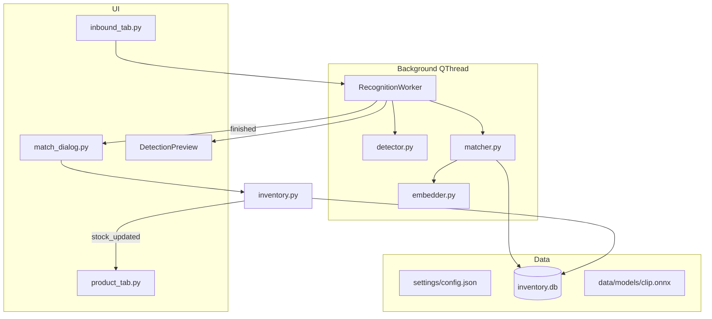
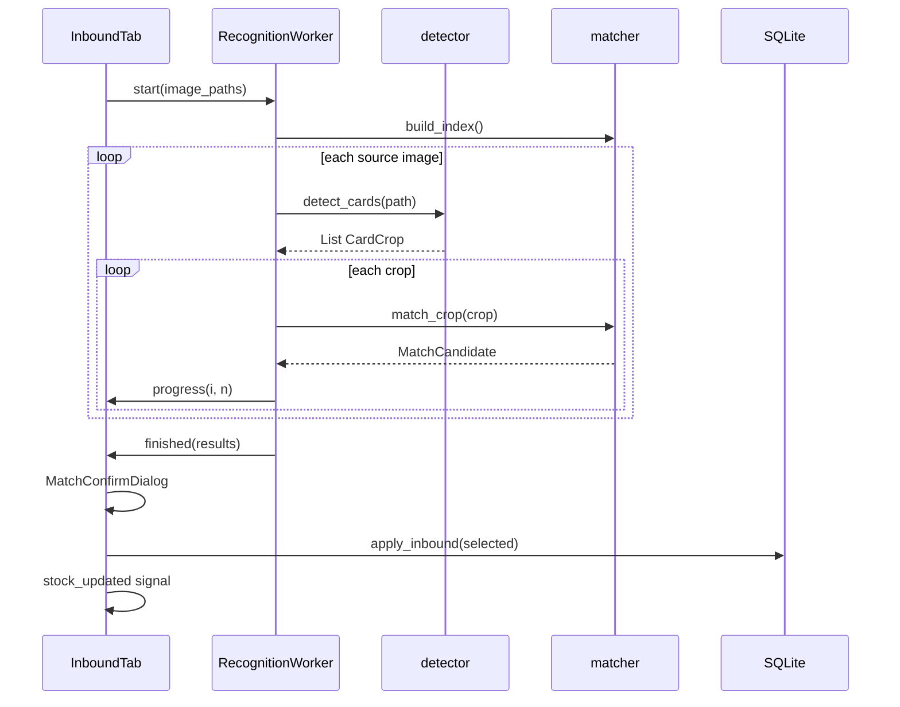

# 阶段二：入库功能实现计划

## 现状与原则

阶段一已完成：[`db/database.py`](db/database.py)、[`db/models.py`](db/models.py)、[`ui/product_tab.py`](ui/product_tab.py)、[`ui/main_window.py`](ui/main_window.py)。`stock` 列存在但从未写入；「入库」Tab 为 disabled 空占位。

**扩展原则：** 不重构阶段一；复用已有 pHash 基础设施（`image_hash` 列 + `compute_image_hash`），**不新增 `phash` 列**；新增 `embedding BLOB` 与 `inventory_logs` 表。

---

## 目标架构



---

## 1. 配置

新建 [`settings/config.json`](settings/config.json)（首次启动自动生成默认值）与 [`settings/config.py`](settings/config.py)：

```json
{
  "clip_threshold": 0.90,
  "phash_top_k": 20,
  "clip_model_path": "data/models/clip-vit-base-patch32.onnx",
  "yolo_model_path": null,
  "card_aspect_ratio_min": 0.55,
  "card_aspect_ratio_max": 0.85
}
```

- `clip_threshold`：CLIP 余弦相似度下限，低于则「未匹配」
- `phash_top_k`：产品库 > top_k 时启用 pHash 预筛
- `yolo_model_path`：非 null 时 [`core/detector.py`](core/detector.py) 优先 YOLO；否则 OpenCV 轮廓+长宽比
- 模型文件**不自动下载**；[`README.md`](README.md) 补充手动下载说明（HuggingFace ONNX CLIP ViT-B/32）

---

## 2. 数据库扩展

### 2.1 迁移（[`db/database.py`](db/database.py) `_migrate_schema`）

```sql
ALTER TABLE products ADD COLUMN embedding BLOB;

CREATE TABLE IF NOT EXISTS inventory_logs (
    id INTEGER PRIMARY KEY AUTOINCREMENT,
    product_id INTEGER NOT NULL REFERENCES products(id),
    delta INTEGER NOT NULL,
    source TEXT NOT NULL,
    image_path TEXT,
    created_at TEXT NOT NULL DEFAULT (datetime('now', 'localtime'))
);
CREATE INDEX IF NOT EXISTS idx_inventory_logs_product ON inventory_logs(product_id);
```

启动时调用 `backfill_product_embeddings()`（类比现有 `backfill_product_hashes`）。

### 2.2 模型层（[`db/models.py`](db/models.py)）

| 新增/改造 | 说明 |
|-----------|------|
| `ProductMatchRow` dataclass | `id, name, image_path, stock, image_hash, embedding` |
| `load_products_for_matching()` | 加载全部有参考图的产品及 embedding/image_hash |
| `save_product_embedding(id, blob)` | 写入 BLOB |
| `backfill_product_embeddings()` | 对 `embedding IS NULL` 的行补算 |
| `import_product` 改造 | 复制图片后调用 embedder 写入 embedding |
| `get_product(id)` | 确认弹窗取当前 stock |
| `increment_stock(product_id, delta, source, image_path)` | `UPDATE stock` + `INSERT inventory_logs` |

**Embedding 存储格式：** CLIP 输出 `float32` 向量 L2 归一化后 `numpy.ndarray.tobytes()`；读取时 `np.frombuffer(..., dtype=np.float32)`。

---

## 3. Core 模块

### 3.1 [`core/embedder.py`](core/embedder.py)

```python
class ClipEmbedder:
    def __init__(self, model_path: Path): ...
    def embed_pil(self, image: Image.Image) -> np.ndarray: ...  # shape (D,), L2-normalized
    def embed_path(self, path: Path) -> np.ndarray: ...
    @staticmethod
    def to_blob(vec: np.ndarray) -> bytes: ...
    @staticmethod
    def from_blob(blob: bytes) -> np.ndarray: ...
```

- 依赖 `onnxruntime` CPU provider（Windows 友好）
- 预处理：Resize 224×224 → ImageNet normalize → NCHW batch
- 模型缺失时抛明确异常，UI 提示查看 README

### 3.2 [`core/detector.py`](core/detector.py)

```python
@dataclass
class CardCrop:
    image: np.ndarray      # BGR crop
    bbox: tuple[int,int,int,int]  # x,y,w,h in source coords
    source_path: Path

def detect_cards(source_path: Path, config) -> list[CardCrop]:
```

**检测逻辑（用户确认：OpenCV 为主）：**

1. 若 `yolo_model_path` 配置且文件存在 → `ultralytics` 推理，按长宽比过滤框
2. 否则 OpenCV：灰度 → 高斯模糊 → Canny → 找轮廓 → 近似四边形 → 按 `card_aspect_ratio_min/max` 过滤 → 透视/axis-aligned crop
3. **零检出或异常** → 整图作为 1 个 `CardCrop`（bbox = 全图）

### 3.3 [`core/matcher.py`](core/matcher.py)

```python
@dataclass
class MatchCandidate:
    product_id: int | None
    product_name: str | None
    score: float | None      # cosine similarity
    stock: int | None
    product_image_path: Path | None

class ProductMatcher:
    def __init__(self, embedder, config): ...
    def build_index(self): ...  # 从 DB 加载一次
    def match_crop(self, crop_bgr: np.ndarray, crop_phash: str) -> MatchCandidate: ...
```

**匹配规则：**

- 产品数 ≤ `phash_top_k`：全量 CLIP 比对
- 产品数 > `phash_top_k`：对 crop pHash 与所有 `image_hash` 算汉明距离 → Top-20 → 仅对这 20 个做 CLIP 余弦相似度
- 取得分最高者；若 `score >= clip_threshold` 则匹配，否则 `product_id=None`（未匹配）
- **同一张 crop 只匹配一个 SKU**（取得分最高，不区分闪卡/普卡）

### 3.4 [`core/inventory.py`](core/inventory.py)

```python
@dataclass
class InboundItem:
    product_id: int
    source_image_path: Path

def apply_inbound(items: list[InboundItem]) -> int:
    """事务内批量 stock += 1，写 inventory_logs(source='inbound')，返回成功条数"""
```

---

## 4. UI 模块

### 4.1 共享缩略图（小 refactor）

将 [`ui/product_tab.py`](ui/product_tab.py) 中的 `ThumbnailSignals` / `ThumbnailLoader` 提取到 [`ui/thumbnails.py`](ui/thumbnails.py)，`product_tab` 与 `match_dialog` 共用，避免循环依赖。

### 4.2 [`ui/inbound_tab.py`](ui/inbound_tab.py)

**布局：**

```
┌─────────────────────────────────────────────────────┐
│ [选择图片] [清空列表]              [开始识别]        │
├─────────────────────────────────────────────────────┤
│ 拖拽区 / 已选文件列表 (QListWidget)                │
├─────────────────────────────────────────────────────┤
│ QProgressBar + 状态文字                              │
├─────────────────────────────────────────────────────┤
│ 检测预览 (DetectionPreview) — 选中列表项时显示       │
│   原图 + OpenCV 绘制 bbox 矩形                       │
└─────────────────────────────────────────────────────┘
```

**交互：**

- 支持 `QFileDialog` 多选 + 拖拽（`dragEnterEvent`/`dropEvent`，复用 `models.collect_image_paths`）
- 「开始识别」→ 禁用按钮 → 启动 `RecognitionWorker(QThread)`
- Worker signals：`progress(int current, int total, str msg)`、`finished(list[RecognitionResult])`、`error(str)`
- 完成后弹出 `MatchConfirmDialog`；用户确认后调用 `apply_inbound`，emit `stock_updated`，刷新预览区

**`RecognitionResult` dataclass（放 `core/` 或 `ui/inbound_tab.py`）：**

`crop_path`（临时 PNG）、`source_path`、`bbox`、`product_id`、`product_name`、`score`、`stock`、`matched: bool`

临时 crop 存 `data/temp/inbound/{uuid}.png`，对话框关闭后清理。

### 4.3 [`ui/match_dialog.py`](ui/match_dialog.py)

`MatchConfirmDialog(QDialog)` — 阶段三清库存也会复用：

| 列 | 控件 |
|----|------|
| 勾选 | `QCheckBox`，匹配行默认 checked；未匹配行 disabled + 灰色 |
| 检测缩略图 | 80×80 async thumb |
| 匹配产品缩略图 | 未匹配显示「—」 |
| 产品名 | 未匹配显示「未匹配」 |
| 相似度 | `f"{score:.2f}"` 或「—」 |
| 当前库存 | |
| 入库后 | `stock + 1` |

底部：`确定` / `取消`；确定返回 `list[InboundItem]`（仅 checked 且 matched 行）。

### 4.4 主窗口（[`ui/main_window.py`](ui/main_window.py)）

```python
product_tab = ProductTab()
inbound_tab = InboundTab()
inbound_tab.stock_updated.connect(product_tab.refresh_products)
tabs.addTab(inbound_tab, "入库")  # 移除 setEnabled(False)
```

---

## 5. 后台线程流程



- **Matcher/Embedder 在 Worker 线程内实例化**（ONNX session 非线程安全，不跨线程共享）
- 进度粒度：`total = sum(crops)` 或按「已处理源图数 + 当前 crop」两级显示

---

## 6. 依赖与 README

[`requirements.txt`](requirements.txt) 追加：

```
numpy>=1.24
onnxruntime>=1.16
ultralytics>=8.0   # 仅 yolo_model_path 配置时使用
```

保留 `opencv-python-headless`（检测 + 预览画框）。

[`README.md`](README.md) 新增章节：

1. 下载 CLIP ONNX 模型到 `data/models/clip-vit-base-patch32.onnx`（附 HuggingFace 链接示例）
2. 可选：自定义 YOLO 卡牌模型路径配置
3. 首次启动会为已有产品补算 embedding（可能较慢，状态栏/控制台提示）

可选脚本 [`scripts/backfill_embeddings.py`](scripts/backfill_embeddings.py) 调用 `backfill_product_embeddings()` 供手动补算。

---

## 7. 验收对照

| 验收项 | 实现 |
|--------|------|
| 导入/启动时生成 embedding | `import_product` + `backfill_product_embeddings` |
| 入库 Tab 批量上传 | `InboundTab` 多选+拖拽 |
| 一张多卡 → 多行结果 | `detect_cards` 多 crop × `match_crop` |
| 确认后库存 +1 且持久化 | `increment_stock` + `ProductTab.refresh_products` |
| inventory_logs 有记录 | `apply_inbound` INSERT |
| 后台线程 UI 不卡 | `RecognitionWorker(QThread)` + `QProgressBar` |
| 检测框预览 | `DetectionPreview` 在 Tab 下方 |

**不做：** 清库存（-1）、PyInstaller 打包。

---

## 8. 实施顺序

按依赖链依次实现，每步可手动验证：

1. **config + DB 迁移** — `embedding`、`inventory_logs`、backfill hook
2. **embedder** — ONNX 推理 + blob 序列化；README 模型说明
3. **models 扩展** — embedding 写入/import/backfill、`increment_stock`
4. **detector** — OpenCV 主路径 + 整图 fallback + 可选 YOLO
5. **matcher** — pHash Top-K + CLIP 精排
6. **inventory** — 事务入库
7. **ui/thumbnails.py** — 提取共享 loader
8. **match_dialog** — 确认表格
9. **inbound_tab + worker + preview** — 完整入库流程
10. **main_window 接线** — 启用 Tab、stock 刷新
11. **端到端测试** — 导入产品 → 补 embedding → 入库多卡照片 → 确认 → 重启验证

---

## 关键设计决策

- **pHash 列：** 复用 `image_hash`，不新增 `phash`
- **检测：** OpenCV 轮廓+长宽比默认；YOLO 仅在 config 指定自定义模型时启用
- **预览：** 纳入本阶段，入库 Tab 下方展示选中源图的 bbox
- **CLIP 模型：** 本地 ONNX，手动下载，无模型时友好报错
