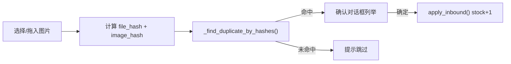

# 入库模块简化重构

## 目标

将入库从「实拍图 → YOLO/OpenCV 裁剪 → ProductMatcher 精排」改为：



匹配规则与 [`db/models.py`](db/models.py) 中 `batch_import` 使用的 `_find_duplicate_by_hashes()` **完全一致**（SHA-256 一致 或 pHash ≤ 5）。

---

## 保留（不动或微调）

| 文件 | 说明 |
|------|------|
| [`core/inventory.py`](core/inventory.py) | `InboundItem` + `apply_inbound()` 继续作为写库入口 |
| [`db/models.py`](db/models.py) | `apply_inbound_batch()`、`_find_duplicate_by_hashes()`、`load_product_hashes()` 保留 |
| [`ui/main_window.py`](ui/main_window.py) | Tab 注册与 `stock_updated` 信号接线不变 |

---

## 删除 / 清理

| 文件 | 操作 |
|------|------|
| [`ui/inbound_tab.py`](ui/inbound_tab.py) | **整文件重写**（删除 `RecognitionWorker` 检测逻辑、`DetectionPreview`、临时 crop 目录、`cv2`/YOLO 依赖） |
| [`core/matcher.py`](core/matcher.py) | **删除**（仅入库使用） |
| [`core/types.py`](core/types.py) | **删除** `RecognitionResult`（或整文件删除，若出库 Tab 未启用） |
| [`ui/match_dialog.py`](ui/match_dialog.py) | **删除或替换**为新的入库确认对话框 |
| [`db/models.py`](db/models.py) | 删除入库专用、`matcher` 独占的：`ProductMatchRow`、`load_products_for_matching()`、`find_product_by_hashes()` |

**不删除** [`core/detector.py`](core/detector.py)：虽入库不再使用，但 [`ui/outbound_tab.py`](ui/outbound_tab.py) 仍引用（当前未挂入主窗口，保留以免后续出库功能恢复时缺文件）。

---

## 新增核心逻辑 — [`db/models.py`](db/models.py)

新增 dataclass 与批量识别函数，直接复用去重逻辑：

```python
@dataclass
class InboundMatch:
    source_path: Path
    source_name: str
    existing_product: Product
    reason: str  # "内容重复" | "图片相似"

def match_inbound_images(
    paths: list[Path],
) -> tuple[list[InboundMatch], list[str]]:
    """对每张图做 hash 比对，返回 (命中列表, 未命中文件名列表)。"""
    # 与 batch_import 相同：load_product_hashes() + compute_file_hash/image_hash
    # 命中：_find_duplicate_by_hashes() 返回 product + reason
    # 未命中：收集 source_name 供 UI 提示
```

与 `batch_import` 的差异：**只识别、不 INSERT**；命中即表示该图对应库中已有产品。

---

## 重写 UI — [`ui/inbound_tab.py`](ui/inbound_tab.py)

**界面结构（简化）：**

- 工具栏：`选择图片` / `清空列表` / `开始识别`
- 文件列表（拖放，复用 [`ui/file_drop.py`](ui/file_drop.py)）
- 进度条 + 状态文字
- **移除**检测框预览区（`DetectionPreview`）

**`InboundWorker(QThread)`：**

- 输入：图片路径列表
- 调用 `models.match_inbound_images(paths)`
- 输出：`(matches, unmatched_names)`

**识别完成后：**

1. 若 `matches` 为空 → 提示「未识别到库中已有产品」
2. 若有 `unmatched_names` → 附加提示「N 张未匹配：xxx...」
3. 弹出确认对话框（见下），用户点「确定」→ `apply_inbound(selected)` → `stock_updated.emit()`

---

## 新确认对话框 — 建议 [`ui/inbound_confirm_dialog.py`](ui/inbound_confirm_dialog.py)

参考 [`ui/product_tab.py`](ui/product_tab.py) 中 `DuplicateProductsDialog` 的表格 + 缩略图风格，但增加：

| 列 | 说明 |
|----|------|
| 勾选 | 默认全选，可取消个别项 |
| 入库图 | 用户选择的源图缩略图 |
| 已有产品 | 库中参考图缩略图 |
| 名称 | 产品名 |
| 匹配原因 | 「内容重复」/「图片相似」 |
| 当前库存 | |
| 入库后 | stock + 1 |

`selected_items() -> list[InboundItem]`：勾选行的 `product_id` + `source_path`。

不再展示「未匹配」行（未命中只在消息框汇总）。

---

## 数据流对比

| | 旧入库 | 新入库 |
|--|--------|--------|
| 输入 | 手机实拍 | 与库中参考图相同/等价的文件 |
| 预处理 | YOLO/OpenCV 裁剪 | 无 |
| 匹配 | `ProductMatcher` / `find_product_by_hashes`（pHash 取最小距离） | `_find_duplicate_by_hashes`（与导入去重相同，pHash 第一个命中） |
| 未匹配 | 对话框灰色行 | 消息框提示，不入列表 |
| 写库 | `apply_inbound_batch` | 不变 |

---

## 文档更新 — [`README.md`](README.md)

- 「入库流程」改为：选择库中已有产品的同款图片 → 识别 → 确认 → 库存 +1
- 删除 YOLO/裁剪/实拍相关描述
- 入库匹配规则改为：与「产品导入去重」相同（SHA-256 + pHash ≤ 5）

---

## 验证清单

1. 选一张**已在库中**的参考图文件入库 → 识别命中，确认后 stock +1，`inventory_logs` 有 `source='inbound'` 记录
2. 选一张**不在库中**的图 → 提示未匹配，库存不变
3. 同一张图选两次 → 确认对话框两条，各 +1（同一产品 +2）
4. 批量混合（有命中/未命中）→ 只列举命中项，未命中在提示中汇总
5. 入库成功后产品 Tab 与操作记录 Tab 自动刷新

---

## 影响说明

- [`ui/outbound_tab.py`](ui/outbound_tab.py) 当前从 `inbound_tab` 导入 `DetectionPreview`；入库重写后该 import 会失效。出库 Tab 未启用，可在本次一并改为本地简单预览或暂留 TODO，不影响主流程。
