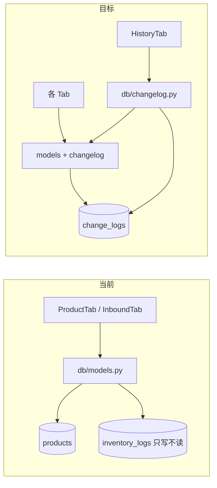
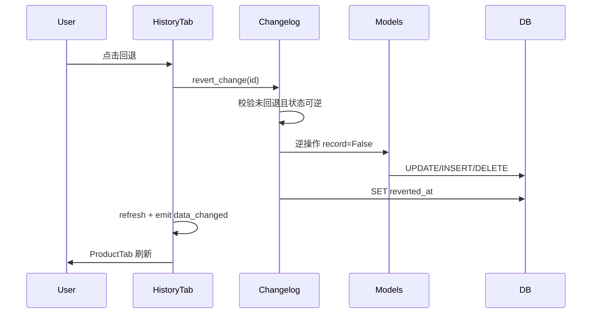

# 操作记录与回退功能

## 现状

- **库存**：[`db/models.py`](d:\code\alexcard_inventory\db\models.py) 的 `increment_stock()` 已写入 `inventory_logs`，但**无读取 UI、无回退**。
- **归类 / 产品 / 产品类**：`move_products`、`create/rename/delete_category`、`rename_product`、`delete_product` 均**无审计**。
- **入口**：[`ui/main_window.py`](d:\code\alexcard_inventory\ui\main_window.py) 仅有「产品管理」「入库」两个可用 Tab。



## 设计方案

### 1. 统一变更表 `change_logs`

在 [`db/database.py`](d:\code\alexcard_inventory\db\database.py) 迁移新增：

```sql
CREATE TABLE IF NOT EXISTS change_logs (
    id INTEGER PRIMARY KEY AUTOINCREMENT,
    kind TEXT NOT NULL,
    summary TEXT NOT NULL,
    payload_json TEXT NOT NULL,
    created_at TEXT NOT NULL DEFAULT (datetime('now', 'localtime')),
    reverted_at TEXT NULL
);
CREATE INDEX IF NOT EXISTS idx_change_logs_created ON change_logs(created_at DESC);
```

同时给现有 `inventory_logs` 增加 `reverted_at TEXT NULL`（库存回退时标记原记录，避免重复回退）。

**`kind` 与 payload 约定**（JSON 存回退所需的完整快照）：

| kind | 触发点 | summary 示例 | payload 关键字段 |
|------|--------|--------------|------------------|
| `stock` | `increment_stock` | 「皮卡丘 库存 +1（入库）」 | `product_id`, `delta`, `source`, `inventory_log_id`, `stock_before` |
| `category_move` | `move_products` | 「3 个产品：未归类 → 宝可梦」 | `moves: [{product_id, old_category_id, new_category_id}]` |
| `category_create` | `create_category` | 「新建产品类：宝可梦」 | `category: {id, name, sort_order}` |
| `category_rename` | `rename_category` | 「产品类重命名：旧名 → 新名」 | `category_id`, `old_name`, `new_name` |
| `category_delete` | `delete_category` | 「删除产品类：宝可梦（含 5 个产品）」 | `category: {id,name,sort_order}`, `affected_product_ids` |
| `product_rename` | `rename_product` | 「产品重命名：A → B」 | `product_id`, `old_name`, `new_name` |
| `product_delete` | `delete_product` | 「删除产品：皮卡丘」 | 完整 `product` 行 + `trash_dir` 路径 |

**批量操作**：一次用户操作（如多选移动、批量改库存、入库确认）写**一条** `change_logs`（`category_move` / 入库可合并为一条 `stock` 含多条 deltas，或入库仍按条记录——建议**入库批次合并为一条** `stock_batch`，手动多选合并为一条 `stock_batch`，与 UI「一次操作一行」一致）。

### 2. 新模块 [`db/changelog.py`](d:\code\alexcard_inventory\db\changelog.py)

职责与现有 `models.py` 分离，避免 CRUD 文件膨胀：

- `ChangeLog` dataclass + `list_change_logs(limit=200)` — 按 `created_at DESC` 查询
- `record_change(kind, summary, payload, conn?)` — INSERT，返回 log id
- `revert_change(log_id) -> None` — 按 kind 分发，事务内执行逆操作并写 `reverted_at`
- `describe_change(log)` — 供 UI 显示（summary 已够用，必要时补产品名）

**回退逻辑要点**：

- **`stock` / `stock_batch`**：对每条 delta 执行 `stock -= delta`（**不**再写新 log）；更新对应 `inventory_logs.reverted_at`；若结果库存 < 0，UI 层先弹确认再调用。
- **`category_move`**：逐条 `UPDATE products SET category_id = old_category_id`。
- **`category_create`**：仅当该类仍存在且无产品时允许删除回退；否则提示「无法回退，状态已变化」。
- **`category_rename`**：`UPDATE categories SET name = old_name`（重名则报错）。
- **`category_delete`**：`INSERT` 恢复 category 行（尽量保留原 `sort_order`），再把 `affected_product_ids` 的 `category_id` 设回该类（新 id 若不同则写入 payload 时记录映射）。
- **`product_rename`**：恢复旧名称。
- **`product_delete`**：删除前将 `data/products/{id}/` **复制**到 `data/trash/{change_log_id}/{id}/`；删除时先 `DELETE FROM inventory_logs WHERE product_id=?`（解决当前 FK 阻止删产品的问题），再删产品行与目录；回退时从 trash 还原目录并以**原 id** `INSERT` 产品行（含 hash 字段）。

所有 `revert_change` 在应用前做**可行性校验**（实体是否存在、是否已回退、名称冲突等），失败抛 `ValueError` 供 UI 展示。

### 3. 改造 [`db/models.py`](d:\code\alexcard_inventory\db\models.py)

在每个 mutation 函数内，**同一事务**中先读旧状态 → 执行 UPDATE/DELETE → 调用 `changelog.record_change`：

- `increment_stock` — 读 `stock_before`，写 `inventory_logs` 后记录 `stock`（或上层 `apply_inbound_batch` / 产品 Tab 批量改库存合并为 `stock_batch`）
- `apply_inbound_batch` — 整批一条 log
- `move_products` — 批量查各 product 的 `old_category_id`，一条 `category_move`
- `create_category` / `rename_category` / `delete_category` — 删类前 snapshot category + 下属 product ids
- `rename_product` — snapshot old_name
- `delete_product` — snapshot + trash copy（见上）

新增可选参数 `*, record: bool = True`，供 `revert_change` 内部逆操作时关闭记录，避免「回退产生新 log」。

### 4. 新 UI：[`ui/history_tab.py`](d:\code\alexcard_inventory\ui\history_tab.py)

新建 Tab「**操作记录**」：

- `QTableWidget` 列：**时间** | **类型** | **说明** | **操作**
- 类型列用中文映射（库存 / 归类 / 新建产品类 / …）
- 操作列：`QPushButton("回退")`；`reverted_at` 非空时显示灰色「已回退」并禁用
- 点击回退 → 若可能产生负库存则 `QMessageBox` 确认 → 调用 `changelog.revert_change` → 成功/失败提示
- 发出 `data_changed` 信号供主窗口刷新

### 5. 接线 [`ui/main_window.py`](d:\code\alexcard_inventory\ui\main_window.py)

```python
history_tab = HistoryTab()
history_tab.data_changed.connect(product_tab.refresh_products)
history_tab.data_changed.connect(product_tab.refresh_categories)
inbound_tab.stock_updated.connect(history_tab.refresh)
# product_tab 内在 mutation 成功后 emit 或 history_tab.refresh() — 更简单：history_tab 在 showEvent/tab 切换时 refresh，mutation 后也 refresh
tabs.addTab(history_tab, "操作记录")
```

产品 Tab 与入库 Tab 在每次成功 mutation 后调用 `history_tab.refresh()`（通过 main_window 注入引用或 signal），保证列表实时更新。

## 数据流（回退）



## 文件变更清单

| 文件 | 变更 |
|------|------|
| [`db/database.py`](d:\code\alexcard_inventory\db\database.py) | 迁移 `change_logs` + `inventory_logs.reverted_at` |
| [`db/changelog.py`](d:\code\alexcard_inventory\db\changelog.py) | **新建** — 记录/列表/回退 |
| [`db/models.py`](d:\code\alexcard_inventory\db\models.py) | 各 mutation 挂钩 record_change；`delete_product` 增加 trash 快照 |
| [`ui/history_tab.py`](d:\code\alexcard_inventory\ui\history_tab.py) | **新建** — 操作记录 Tab |
| [`ui/main_window.py`](d:\code\alexcard_inventory\ui\main_window.py) | 注册 Tab + 信号连接 |
| [`ui/product_tab.py`](d:\code\alexcard_inventory\ui\product_tab.py) | mutation 后刷新 history（轻量改动） |
| [`ui/inbound_tab.py`](d:\code\alexcard_inventory\ui\inbound_tab.py) | 入库成功后刷新 history |

## 边界与限制（需在 UI 提示）

- 已回退的记录不可再次回退。
- 若后续操作依赖被回退的状态（例如删除产品类后又新建了同名类），回退可能失败并提示原因。
- 产品删除回退依赖 `data/trash/` 快照；若 trash 被手动清理则无法恢复。
- 历史记录默认展示最近 200 条（可后续加分页）。

## 验证步骤

1. 手动改库存 → 操作记录出现条目 → 回退后库存恢复。
2. 入库一批 → 一条批次记录 → 回退后整批 -1。
3. 拖拽/批量移动归类 → 回退后 category_id 恢复。
4. 新建/重命名/删除产品类 → 各自回退验证。
5. 重命名/删除产品 → 删除后回退，图片与库存恢复。
6. 已回退行按钮禁用；ProductTab 与侧边栏计数同步刷新。
