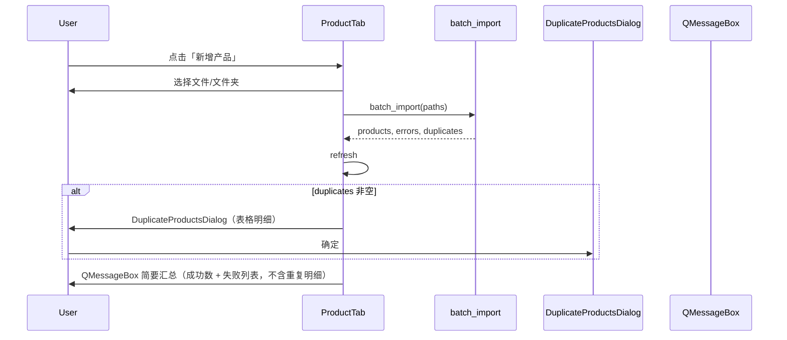

# 新增产品：重复明细弹窗与文案重命名

## 现状

- 工具栏按钮与入口弹窗文案为「导入图片」([`ui/product_tab.py`](ui/product_tab.py) L270、L603)。
- [`batch_import`](db/models.py) 返回 `skipped: list[str]`（如 `"a.jpg: 内容重复"`），UI 用 `QMessageBox` 纯文本列举（最多 10 条）。
- **缺陷**：[`_find_duplicate_by_hashes`](db/models.py) 在 `file_hash` 命中时返回 `(None, "内容重复")`，未带上已有 `Product`，无法展示缩略图/库存/产品类。

```329:336:db/models.py
def _find_duplicate_by_hashes(...) -> tuple[Product | None, str | None]:
    if file_hash in known_file_hashes:
        return None, "内容重复"  # 应返回 known_file_hashes[file_hash]
```

## 目标行为



## 1. 数据层：结构化重复记录

**文件**：[`db/models.py`](db/models.py)

新增 dataclass：

```python
@dataclass
class ImportDuplicate:
    source_path: Path      # 本次尝试新增的文件
    source_name: str       # path.name，便于展示
    existing_product: Product
    reason: str            # "内容重复" | "图片相似"
```

修改 `_find_duplicate_by_hashes`：

- `file_hash` 命中 → `return known_file_hashes[file_hash], "内容重复"`
- pHash 命中 → 保持现有逻辑

修改 `batch_import` 签名与实现：

```python
def batch_import(paths) -> tuple[list[Product], list[str], list[ImportDuplicate]]:
```

- 将 `skipped.append(f"{path.name}: {reason}")` 改为追加 `ImportDuplicate(...)`（需保证 `existing_product` 非 None；若极端情况下为 None 则仍记入 errors）
- 同批次第二份相同文件：`known_file_hashes` 中已有本批次刚导入的产品，可正确关联

## 2. UI：重复明细对话框

**文件**：[`ui/product_tab.py`](ui/product_tab.py)（与现有 `StockAdjustDialog` 同级，参考 [`ui/match_dialog.py`](ui/match_dialog.py) 的表格 + `ThumbnailLoader` 模式）

新增 `DuplicateProductsDialog(QDialog)`：

| 列 | 内容 |
|---|---|
| 新图 | 源文件缩略图（`source_path`） |
| 已有产品 | 库中匹配产品的缩略图（`get_product_image_path(existing_product)`） |
| 名称 | `existing_product.name` |
| 库存 | `existing_product.stock` |
| 产品类 | `category_id` 映射为名称；`None` 显示「未归类」 |

实现要点：

- 使用 `QTableWidget` + `ThumbnailLoader` / `ThumbnailSignals`（缩略图尺寸建议 80px，与入库确认对话框一致）
- 顶部 `QLabel` 汇总：`跳过 N 个重复产品`
- 底部「确定」关闭
- `closeEvent` 中递增 generation，避免关闭后异步回调写 UI

## 3. UI：改造 `import_images_dialog` 流程与文案

**文件**：[`ui/product_tab.py`](ui/product_tab.py)

### 文案替换（用户可见）

| 原文字 | 新文字 |
|---|---|
| 按钮「导入图片」 | **新增产品** |
| 弹窗标题「导入图片」 | **新增产品** |
| 「选择导入方式」 | **选择新增方式** |
| 「成功导入 N 张图片」 | **成功新增 N 个产品** |
| 「跳过 N 张重复图片」+ 文本列表 | 移除（改由表格弹窗展示） |
| 「导入完成」 | **新增完成** |
| 「导入失败」 | **新增失败** |
| 「以下文件导入失败」 | **以下文件新增失败** |

`QFileDialog` 标题「选择图片」「选择文件夹」可保持不变（选文件语义仍清晰）。

### 结果展示顺序（用户选择：先表格再简要提示）

```python
products, errors, duplicates = models.batch_import(paths)
self.refresh_categories()
self.refresh_products()

if duplicates:
    DuplicateProductsDialog(duplicates, parent=self).exec()

message_parts = []
if products:
    message_parts.append(f"成功新增 {len(products)} 个产品。")
if errors:
    message_parts.append("以下文件新增失败:\n" + "\n".join(errors[:10]))
    ...
if message_parts:
    QMessageBox.information(self, "新增完成", "\n\n".join(message_parts))
elif not duplicates:
    # 全跳过且无错误时，表格弹窗已说明，可选不再弹第二条
    pass
```

边界：

- 仅有重复、无成功、无错误 → 只显示表格弹窗，不再弹第二条空消息
- 有成功或失败 → 表格弹窗关闭后再弹简要 `QMessageBox`

## 4. 涉及文件

| 文件 | 变更 |
|---|---|
| [`db/models.py`](db/models.py) | `ImportDuplicate`、` _find_duplicate_by_hashes` 修复、`batch_import` 返回值 |
| [`ui/product_tab.py`](ui/product_tab.py) | `DuplicateProductsDialog`、文案、`import_images_dialog` 流程 |

不改动 README / plan 文档（非用户请求范围）。

## 5. 手动验证

1. 新增一张新产品 → 仅「成功新增 1 个产品」提示，无重复弹窗
2. 再次新增同一张图 → 表格弹窗：双缩略图、名称、库存、产品类正确；关闭后无第二条消息（或仅有成功 0 时不弹第二条）
3. 新增视觉相似图 → 表格弹窗 reason 为图片相似，「已有产品」列显示匹配项
4. 批量混合（新图 + 重复 + 损坏文件）→ 先表格（重复），再消息（成功数 + 失败文件）
5. 确认工具栏按钮与入口弹窗标题均为「新增产品」
