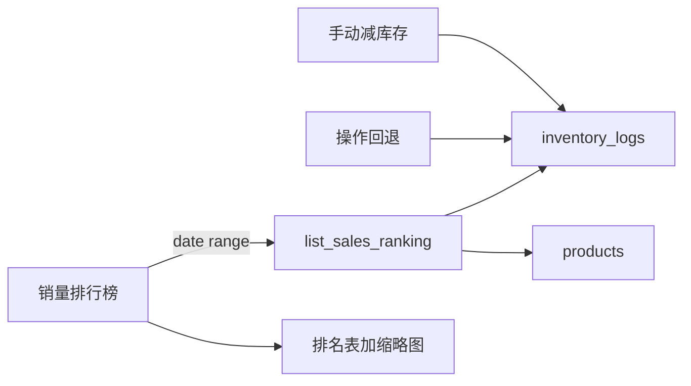

# 销量排行榜 Tab

## 统计规则

- 数据源：`inventory_logs`，条件 `source = 'manual'` 且 `delta < 0` 且 `reverted_at IS NULL`
- 销量 = `SUM(-delta)`（同产品多次减少累加；已回退的流水不计入）
- 排序：销量从高到低；无销量产品不出现

## 改动

### 1. 查询层 — [`db/models.py`](db/models.py)

新增 `list_sales_ranking(start: str, end: str)`，返回排名行（`product_id`、`name`、`image_path`、`sold_qty`）：

```sql
SELECT p.id, p.name, p.image_path, SUM(-il.delta) AS sold_qty
FROM inventory_logs il
JOIN products p ON p.id = il.product_id
WHERE il.source = 'manual'
  AND il.delta < 0
  AND il.reverted_at IS NULL
  AND il.created_at >= ? AND il.created_at <= ?
GROUP BY p.id
ORDER BY sold_qty DESC
```

时间边界用本地字符串，与现有 `created_at` 格式一致：`YYYY-MM-DD 00:00:00` ~ `YYYY-MM-DD 23:59:59`。

### 2. 新 UI — `ui/sales_ranking_tab.py`

参考 [`ui/history_tab.py`](ui/history_tab.py) 的表格壳 + [`ui/inbound_confirm_dialog.py`](ui/inbound_confirm_dialog.py) 的缩略图单元格：

- 顶部筛选：预设「今天 / 近7天 / 本月」+ 起止 `QDateEdit` +「查询」按钮（默认近7天）
- 表格列：**排名 | 图片 | 产品名称 | 减少数量**
- 图片：`ThumbnailLoader` + `models.get_product_image_path`（约 64×64）
- `showEvent` / 外部 `refresh` 时按当前日期范围重查

### 3. 挂载 — [`ui/main_window.py`](ui/main_window.py)

在「操作记录」与「清库存」之间插入：

```python
tabs.addTab(history_tab, "操作记录")
tabs.addTab(sales_tab, "销量排行榜")
# 清库存占位保持不变
```

信号：`product_tab.data_changed` 与 `history_tab.data_changed` 都连到 `sales_tab.refresh`（手动改库存、回退都会影响排名）。

## 数据流



## 不改动的部分

- 「清库存」仍为禁用占位
- 不引入出库/`outbound` 统计；仅手动减少
- 暂不加新索引（数据量小时够用；若后续变慢再加 `(source, created_at)`）
